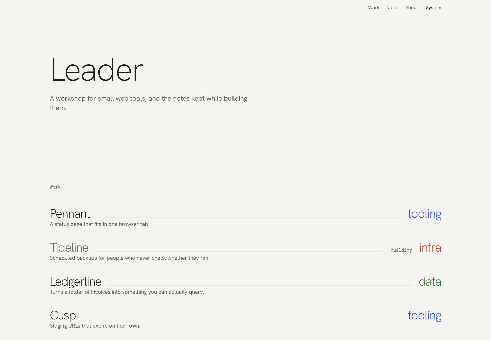

# Leader

A contents page for a workshop. An Astro theme for a maker with several small products:
one ruled row per thing you ship, the leader rule running out to its category, and the
notes you kept while building it filed underneath. Free and MIT-licensed.

[Live demo](https://leader-free.ondelva.com) · [Pro demo](https://leader.ondelva.com) ·
[Get Pro](https://buy.polar.sh/polar_cl_0zouNlGburJgShVnOKjZvp5I5l9RcGea0n6ZR3TsHSg) ·
[Customization](docs/customization.md) · [Content](docs/content.md) ·
[Deploy](docs/deploy.md)



More screens, light and dark, desktop and phone: [`docs/screenshots/`](docs/screenshots/).

## What it is

- **The leader rule.** A row is a product on the left, its category on the right, and a
  hairline joining them the way a printed table of contents joins a title to its page
  number. On hover the rule thickens into the category's colour and takes the title with
  it. The same row is the shelf, the notes list and the category pages.
- **Colour means one thing.** Four categories, one accent each, running from the index
  row to the product page to every note filed under it. Nothing else on the page is
  coloured, so the right-hand edge reads as a column of groups.
- **No key images.** The theme is set in type and rules, and it is finished without a
  single screenshot or photograph. Nothing waits on artwork you have not made yet.
- **No client-side framework.** Astro 7, Tailwind CSS v4, static output. The only
  JavaScript it ships is the theme switcher.

## Features

- Home, work shelf, product page, notes with pagination, note, category page, about,
  contact, legal pages, 404
- Content collections for work and notes, typed with zod, with eight sample products and
  twelve sample notes
- Light and dark mode from `light-dark()` tokens and a three-state switcher
- RSS feed, sitemap, `robots.txt`, canonical URLs, Open Graph, Twitter cards, JSON-LD
- Analytics slot (Plausible, GA4, Umami) and a contact form that posts to any static form
  service — both off until you configure them
- WCAG AA on every colour pair and Lighthouse 95+ on all four categories, both checked in
  CI
- `AGENTS.md` for Claude Code, Cursor and other agents, with `CLAUDE.md` pointing at it

## Quick start

You need Node.js 22.12+ and pnpm 9 or newer (`npm i -g pnpm`). `package.json` pins the
exact pnpm version, and pnpm 10+ switches to it on its own.

```sh
pnpm create astro@latest my-workshop -- --template ondelva/astro-theme-leader
cd my-workshop
pnpm install
pnpm dev
```

`pnpm dev` also serves `/styleguide`, where every colour token and type size is on one
page.

## Configure

`src/config.ts` is the single entry point: name, URL, author, navigation, social links,
SEO defaults, the categories and their accents, the signature switch, pagination, the
contact endpoint and the analytics slot. Nothing site-specific is hardcoded anywhere else.

Colours, type and layout are CSS tokens; override them in `src/styles/theme.css`, never in
`tokens.css`. Webfonts are declared in `astro.config.mjs`.

- [docs/customization.md](docs/customization.md) — every config field, the tokens, the
  leader rule, the theme's own words
- [docs/content.md](docs/content.md) — the two collections and every field
- [docs/deploy.md](docs/deploy.md) — build, hosting, CI

## Deploy

Static output. Works on Cloudflare, Vercel, Netlify and GitHub Pages. One click and the
host clones this repository into your account, builds it and puts it online:

[](https://deploy.workers.cloudflare.com/?url=https://github.com/ondelva/astro-theme-leader)
[](https://app.netlify.com/start/deploy?repository=https://github.com/ondelva/astro-theme-leader)
[](https://vercel.com/new/clone?repository-url=https://github.com/ondelva/astro-theme-leader)

Set `site.url` — or `SITE_URL` in the build environment — to your address afterwards. See
[docs/deploy.md](docs/deploy.md).

## Scripts

```sh
pnpm dev             # dev server, /styleguide included
pnpm build           # static site into dist/
pnpm preview         # serve dist/
pnpm check           # astro check — types and templates
pnpm check:contrast  # every colour pair against WCAG AA, both modes
pnpm lint
pnpm format
```

`pnpm check && pnpm build` is the gate to run after any change.

## Footer credit

The footer carries one line — `Leader theme by ondelva`, linking to this repository. It is
the last `<p>` in `src/components/common/Footer.astro`; delete it if you would rather not
have it. Keeping it is how the next person finds the theme. Leader Pro ships without it.

## Free vs Pro

Leader Pro is the same shelf with a second axis through it, the reading apparatus, the
variants and the integrations. See it running at
[leader.ondelva.com](https://leader.ondelva.com), and [buy it here](https://buy.polar.sh/polar_cl_0zouNlGburJgShVnOKjZvp5I5l9RcGea0n6ZR3TsHSg) — $49 for one
person, $129 for a team of up to ten.

|                | Free (this repo)                                                       | Pro                                                                           |
| -------------- | ---------------------------------------------------------------------- | ----------------------------------------------------------------------------- |
| Pages          | Home, work, product, notes, note, category, about, contact, legal, 404 | + tags, archive, authors, search                                              |
| Second axis    | Category only                                                          | Tags across products and notes, series, author pages                          |
| Reading        | Body copy, footnotes, previous/next                                    | + contents rail, related notes, callouts, code copy buttons                   |
| Finding        | Category pages, one RSS feed                                           | + Pagefind search, status and category filters on `/work`, per-category feeds |
| Products       | Row, summary, links                                                    | + changelog per product                                                       |
| Colour presets | 1                                                                      | 4                                                                             |
| Font pairings  | The one it ships in                                                    | + 2 ready-made alternatives                                                   |
| Share cards    | One static default                                                     | One drawn per product and per note at build time                              |
| Integrations   | Analytics, contact form endpoint                                       | + newsletter (Buttondown), comments (giscus), Web3Forms key and redirect      |
| i18n           | UI strings in `src/i18n/` (English, Korean)                            | + a second language under `/ko/`: editions, language list, hreflang           |
| Footer credit  | One line, easy to remove                                               | None                                                                          |
| License        | MIT                                                                    | Commercial, unlimited end products                                            |
| Support        | GitHub Issues                                                          | Email (im@ondelva.com), 2 business days                                       |

## License

MIT, see [LICENSE](LICENSE).
Third-party assets: [THIRD-PARTY-NOTICES.md](THIRD-PARTY-NOTICES.md)
